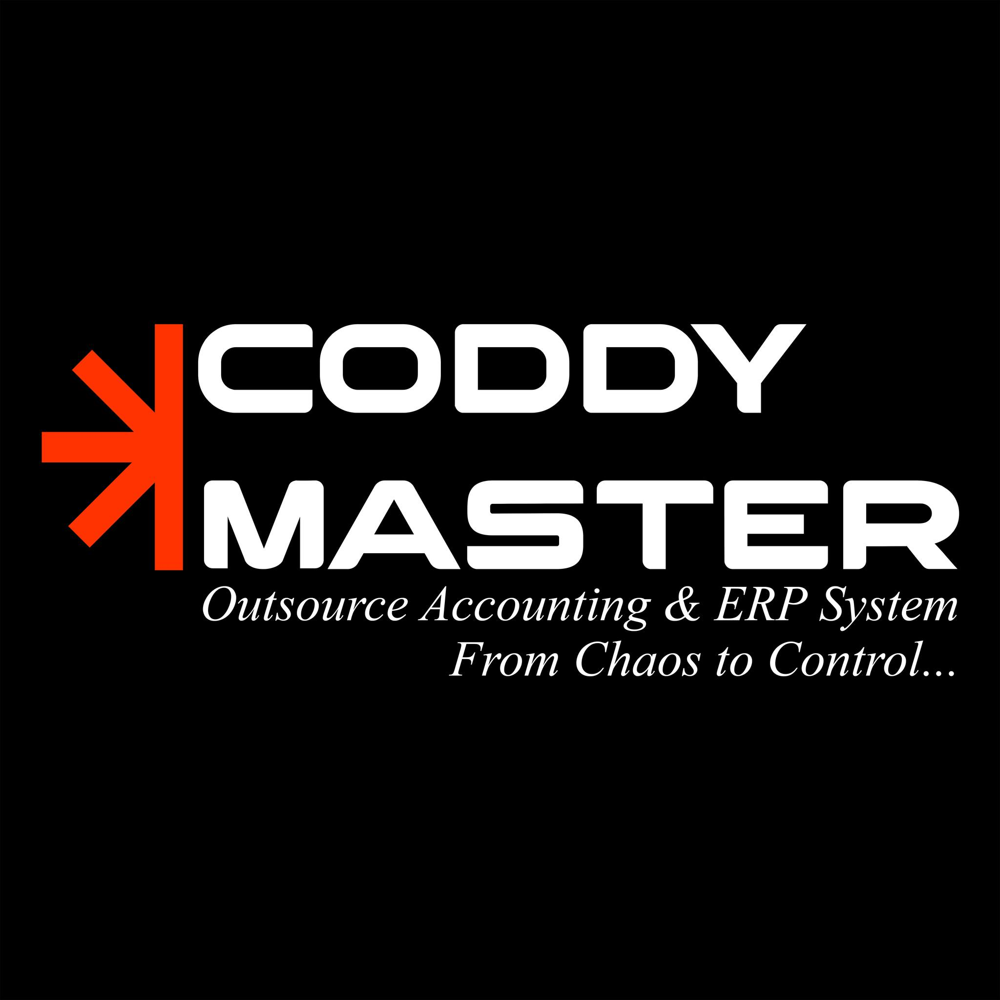

  

  
  
  

---

## 🔸 THE MISSION: FROM CHAOS TO CONTROL 🚀

We are **Coddy Master** — a tech-powered financial partner engineered specifically for small/medium-sized businesses and factory owners across Egypt and the Arab world. 

We bridge the gap between financial compliance and hyper-growth. We don't just deliver financial data late; we build the real-time cloud infrastructure that allows business owners to make numbers-driven choices.

> 💡 **Our Philosophy:** *We deliver clarity, not comfort.*

---

## 🔸 OUR CORE ECOSYSTEM (THE 3 PILLARS)

<table width="100%">
  <tr>
    <td width="33.3%" align="center" valign="top">
      <h3>🔢 1. Outsourced Accounting</h3>
      
Bank-level accurate bookkeeping, automated journals, payroll, VAT filing, and comprehensive tax compliance engineered for modern businesses.

    </td>
    <td width="33.3%" align="center" valign="top">
      <h3>⚙️ 2. Odoo ERP Systems</h3>
      
As an <b>Official Odoo Partner</b>, we design, customize, and implement end-to-end ERP workflows (Sales, Inventory, Manufacturing, and CRM) to centralize operations.

    </td>
    <td width="33.3%" align="center" valign="top">
      <h3>📊 3. Virtual CFO Leadership</h3>
      
Owner-level live dashboards, strict cash-flow forecasting, product margin analysis, and strategic financial scaling models.

    </td>
  </tr>
</table>

---

## 🔸 TECHNICAL & IMPLEMENTATION STACK

To ensure flawless data synchronization from the factory floor to the balance sheet, our development team builds upon:

* **ERP Development:** Odoo Framework, Python configurations, XML views, and custom module architecture.
* **Data Automation:** Automated data pipelines syncing Branch POS platforms and E-commerce channels into centralized financial databases.
* **Cloud Infrastructure:** Secure, highly-available cloud environments tailored for real-time management reporting.

---

## 🔸 LET'S TRANSFORM YOUR OPERATIONS

Ready to stop guessing and start scaling with institutional clarity? Let’s connect!

* 🌐 **Official Website:** [coddymaster.com](https://coddymaster.com)
* 💼 **LinkedIn:** [Coddy Master on LinkedIn](https://www.linkedin.com/company/coddy-master/)
* 🔹 **Facebook:** [Coddy Master on Facebook](https://www.facebook.com/CoddyMaster?locale=ar_AR)
* 📧 **Business Email:** [info@coddymaster.com](mailto:info@coddymaster.com)
* 📞 **Direct WhatsApp:** [+20 100 527 5315](https://wa.me/201005275315)
* 📍 **Headquarters:** New Damietta, Egypt

---

  <b>Coddy Master</b> | <i>Mastering Code, Empowering Financial Control.</i>

